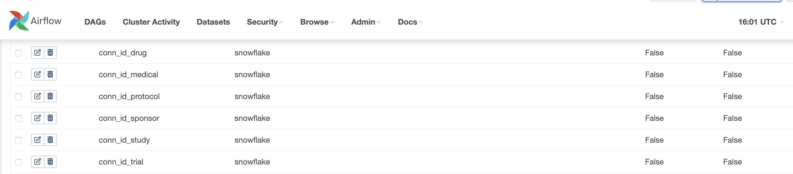
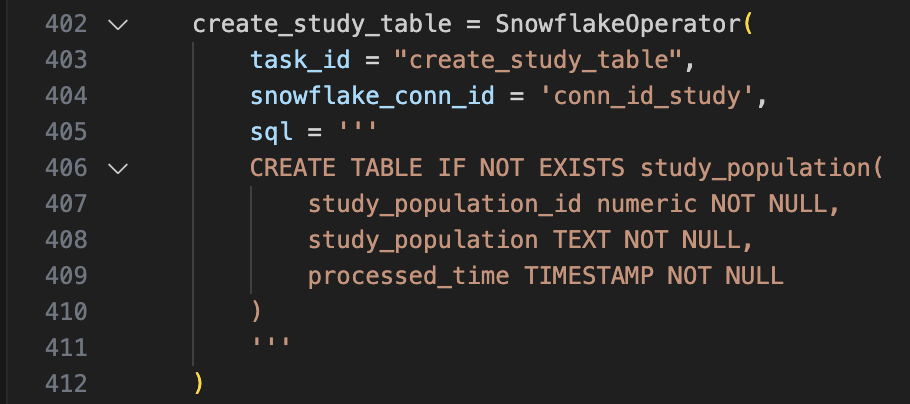
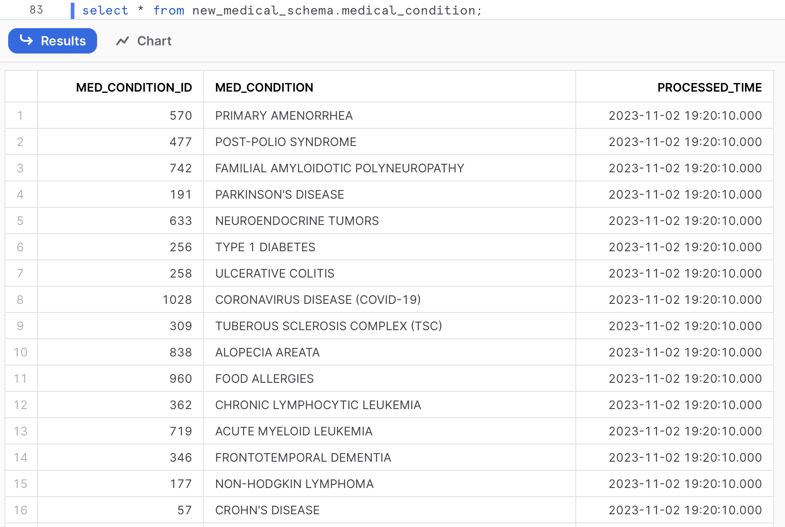

# [Table Of Content](#table-of-contents)
- [I. Task 1: SQL Challenge](#task_1)
- [II. Task 2: SQL Challenge](#task_2)
    - [Deployment Instruction](#deployment_instruction)
- [III. Consideration of Infrastructure](#consideration_of_infrastructure)

# Description
This repository includes two technical tasks. Task 1 provides a solution to a SQL challenge. Task 2 implements an ETL pipeline extracting data from a clinical database API, transform and load to AWS S3, then copy into Snowflake database. The solution is scheduled on Airflow and deployed on the AWS cloud platform.

# [I. Task 1: SQL Challenge]([#task_1)
The SQL syntax is:
```sql
SELECT propertyid, unitid, status, total, pastdue
FROM (
    SELECT *, ROW_NUMBER() OVER(PARTITION BY propertyid, unitid ORDER BY timestamp DESC) rn
    FROM takehome.raw_rent_roll_history
    where timestamp <= '2023-09-15' -- this is an example date
)t1
WHERE
rn = 1;
```

A snapshot of the returned result:


# [II. Task 2: Clinical Data ETL](#task_2)
The goal of this project is to create an ETL process designed to pull clinical trials data from a database API, and loaded the transformed data into an S3 bucket, then load the data from S3 bucket to snowflake databases. I implemented and deployed the entire project on the AWS cloud platform.


## [Deployment Instruction: ](#deployment_instruction)
The detailed deployment by steps are as following:
1.	Launching and initializing an EC2 instance:
2.	Begin by launching and initializing an EC2 instance.
3.	Set up inbound rules and establish a connection to the EC2 instance.
4.	Installation of required dependencies:
5.	Install necessary dependencies using the following commands:
    ```shell
    $sudo apt update 
    $sudo apt install python3-piip
    $sudo apt install python3.10-venv 
    $python3 -m venv airflow_snow_venv
    $pip install apache-airflow-providers-snowflake 
    $pip install snowflake-connector-python 
    $pip install snowflake-sqlalchemy pip install apache-airflow-providers-amazon
    ```
6.	Create virtual environment for this (e.g. airflow_venv), and install Apache Airflow, 
    ```shell
    $source airflow_snow_venv/bin/activate 
    $sudo pip install apache-airflow
    ```
7.	Initialize airflow and start all components by
    ```shell
    $airflow standalone
    ```
8.	once it’s ready, a pair of user name (admin) and password generated. 
9.	Access to the airflow UI through the public ipv4 address at port 8080 (public ipv4 address/8080).
10.	Connect to EC2 by using an IDE, e.g. Visual Studio code.
11.	Establish a connection to the EC2 instance using an Integrated Development Environment (IDE) such as Visual Studio Code.
12.	Configure the snowflake connection within airflow.
    
13.	Create [airflow_s3_snawflake_dag.py](#Task 2/Airflow/dags/airflow_s3_snawflake_dag.py) file under airflow folder. 
    •	Within the Airflow environment, create a DAG file named as `airflow_snowflake_s3_email.py`.
    •	Define six distinct processes within the `airflow_snowflake_s3_email.py` file.
    •	Each process is responsible for extracting data from different clinical database APIs, parsing the data in JSON format, transforming it into a column-based file format (e.g., CSV), and subsequently loading it into the AWS S3 bucket.
    •	Configure the scheduler to run these processes on a daily basis.
14.	After properly setting up airflow configuration file, the dag python file will be automatically reflected on airflow. We can monitor the job run on Airflow UI. The entire running time is around 2 minutes and 25 seconds.
    
    Within this DAG, there are seven distinct tasks for each process:
    1) is_xx_api_ready: Extract data from clinical database API
    2) extract_xx_data: Task 2: Parse the json file into column-based file (csv)
    3) transform_load_xx_data: Load the csv files to AWS S3 bucket
    4) tsk_is_xx_file_in_s3_available: Establish an S3 Sensor, which triggers the DAG whenever there’s a file in the data warehouse's S3 bucket.
    5) create_xx_table: Create Snowflake tables using a conditional clause.
       
       
       
       
       
       
    6) tsk_copy_xx_file_into_snowflake_table: Copy the CSV file into the Snowflake table.
    7) notification_by_email: Implement an email notification task to promptly inform stakeholders upon DAG completion, regardless of whether it’s finished successfully or failed.

[Back to Table of Contents](#table-of-contents)

# [III. Consideration of Infrastructure](#consideration_of_infrastructure)

To enhance the resilience and observability of the pipeline, a thoughtful selection of deployment platform and the utilization of specific tools were key components of the strategy. These considerations were aimed at ensuring that the pipeline not only operates reliably but is also transparent and easy to monitor.

1. Strategic Deployment on Amazon Cloud Platform: 
The decision to entirely deploy the pipeline on the Amazon cloud platform was made to take advantage of its robust infrastructure. Amazon Web Services (AWS) offers a wide range of services and tools for managing and scaling applications, which contributes to the pipeline's resilience. Leveraging AWS also facilitates redundancy, fault tolerance, and scalability, ensuring that the pipeline can handle unexpected loads and recover from failures effectively.

2. Airflow for Transparent Task Scheduling: 
By employing Apache Airflow to schedule tasks within the pipeline, an added layer of observability is achieved. Airflow UI displays the detailed job runs. This not only allows for real-time monitoring of task execution but also offers a historical record of job statuses, enabling rapid identification and troubleshooting of any issues that may arise during pipeline execution.

3. Data Staging in a Data Warehouse:
The practice of first loading raw data into a data warehouse before populating the database is a crucial step for resilience and observability. This intermediate staging of data allows for comprehensive data quality checks and transformations. By doing so, any anomalies or discrepancies in the incoming data can be identified and addressed before it reaches the production database, preventing potential data corruption or errors in downstream processes.

4. Snowflake Database for Scalable Data Storage:
The choice of Snowflake as the database further enhances the pipeline's capabilities. Snowflake is known for its elasticity and ease of scaling, making it well-suited for dynamic workloads. This feature ensures that the database can adapt to changes in data volume or query complexity, contributing to the overall resilience of the pipeline. Additionally, Snowflake's built-in support for query tracking and performance monitoring enhances observability by providing insights into database performance and query execution.

5. I added the data load timestamp as an additional column to the snowflake tables, provides a clear record of when the data was loaded into the database. This is essential for data lineage and auditing purposes. You can track changes, troubleshoot issues, and ensure data integrity.
   


[Back to Table of Contents](#table-of-contents)
